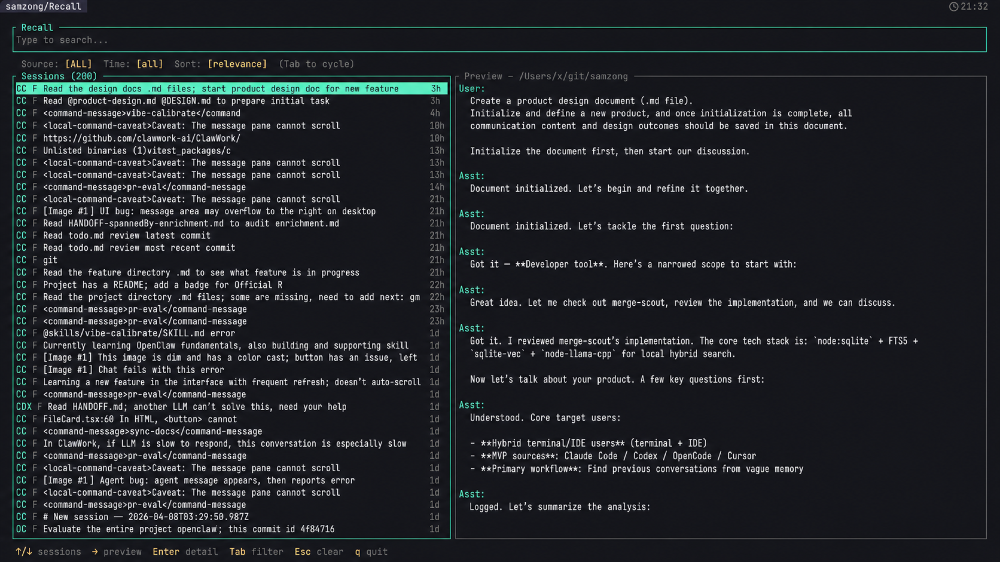
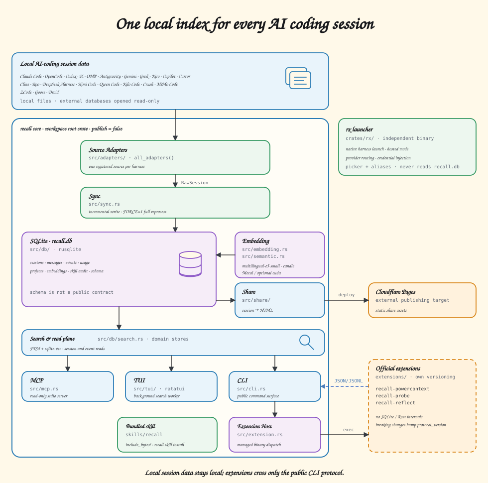

**English** | [Chinese](./README.zh-CN.md)

# Recall

[](https://app.codspeed.io/samzong/Recall?utm_source=badge)

> Local-first search across every AI coding session on your machine.

[](https://asciinema.org/a/909453)

Jump between Claude Code, Codex, and whatever comes next; Recall pulls those scattered local sessions into one searchable index, tracks usage when token metadata is available, and drops you back into the original CLI.

## Architecture



## Install

```bash
brew install samzong/tap/recall
```

## Usage

```bash
recall sync          # incremental sync of the current project (safe to run anytime)
recall sync --project all  # sync every project and run index-wide maintenance
recall               # launch TUI
recall usage         # usage dashboard
recall export --project all > recall-export.jsonl # export all sessions
recall import recall-export.jsonl --dry-run  # preview an import
recall session list  # list sessions for agents/scripts
recall session share --id <session-id> --format json  # publish one selected session
recall session delete --id <session-id> --dry-run  # preview safe session deletion
recall info  # index stats and worker status
```

### Delete sessions

`recall session delete` removes one selected session from Recall and, when the source has a safe native deletion path, from the source agent as well.

```bash
recall session delete --id <session-id> --dry-run   # preview only
recall session delete --id <session-id>             # safe default: keep a Recall trash backup
recall session delete --id <session-id> --permanent # no Recall trash backup
recall session delete --id <session-id> --index-only # leave source-agent data untouched
```

Codex and OpenCode use their official delete commands so their own metadata stays consistent. Claude Code, Pi, OMP, Antigravity, Gemini, Grok, Copilot CLI, Cline, DeepSeek Harness, and Kimi Code use validated per-session files or directories. Shared-database sources without a stable native delete API require `--index-only`; Recall deliberately does not guess writes into their databases.

On Windows, the default trash is the `trash` directory beside the installed `recall.exe`; the Scoop package persists that directory across upgrades. `RECALL_TRASH_DIR` can override the location. On other platforms Recall falls back to its data directory. For sources with an official native delete command, Recall creates a safety backup first; for file-backed sources it moves the native session data into the trash. Imported sessions are always index-only.

With Skill use **Recall** is the best way.

```bash
recall skill install # auto detect agents and install skills
```

## Support

One index across every AI coding CLI. Sync once, search everywhere, resume right where you left off.

| Adapter         | Discovery | Full-index | Incremental-sync | Semantic-search | Export | Resume | Usage |
| --------------- | :-------: | :--------: | :--------------: | :-------------: | :-------------: | :----: | :----: |
| Claude Code     |     ✅    |     ✅     |        ✅        |        ✅       |        ✅       |   ✅   |   ✅   |
| OpenCode        |     ✅    |     ✅     |        ✅        |        ✅       |        ✅       |   ✅   |   ✅   |
| Codex           |     ✅    |     ✅     |        ✅        |        ✅       |        ✅       |   ✅   |   ✅   |
| Pi              |     ✅    |     ✅     |        ✅        |        ✅       |        ✅       |   ✅   |   ✅   |
| OMP             |     ✅    |     ✅     |        ✅        |        ✅       |        ✅       |   ✅   |   ✅   |
| Antigravity |     ✅    |     ✅     |        ✅        |        ✅       |        ✅       |   ✅   |      |
| Gemini          |     ✅    |     ✅     |        ✅        |        ✅       |        ✅       |   ✅   |   ✅   |
| Kiro            |     ✅    |     ✅     |        ✅        |        ✅       |        ✅       |   —    |       |
| Copilot     |     ✅    |     ✅     |        ✅        |        ✅       |        ✅       |   ✅   |   ✅   |
| Copilot Chat |     ✅    |     ✅     |        ✅        |        ✅       |        ✅       |   —    |      |
| Cursor          |     ✅    |     ✅     |        ✅        |        ✅       |        ✅       |   —    |   ✅   |
| Cline           |     ✅    |     ✅     |        ✅        |        ✅       |        ✅       |   —    |       |
| Roo             |     ✅    |     ✅     |        ✅        |        ✅       |        ✅       |   —    |       |
| DeepSeek Harness |     ✅    |     ✅     |        ✅        |        ✅       |        ✅       |   —    |   ✅   |
| Grok            |     ✅    |     ✅     |        ✅        |        ✅       |        ✅       |   ✅   |   ✅   |
| Kimi Code       |     ✅    |     ✅     |        ✅        |        ✅       |        ✅       |   ✅   |   ✅   |
| Qwen Code       |     ✅    |     ✅     |        ✅        |        ✅       |        ✅       |   ✅   |   ✅   |
| Kilo Code       |     ✅    |     ✅     |        ✅        |        ✅       |        ✅       |   ✅   |   ✅   |
| Crush           |     ✅    |     ✅     |        ✅        |        ✅       |        ✅       |   ✅   |   ✅   |
| MiMo Code       |     ✅    |     ✅     |        ✅        |        ✅       |        ✅       |   ✅   |   ✅   |
| ZCode           |     ✅    |     ✅     |        ✅        |        ✅       |        ✅       |   ✅   |   ✅   |
| Goose           |     ✅    |     ✅     |        ✅        |        ✅       |        ✅       |   ✅   |   ✅   |

## Acknowledgements

- Thanks to [tokscale](https://github.com/junhoyeo/tokscale) for the usage dashboard reference and token accounting behavior.
- Thanks to [Ratatui](https://github.com/ratatui/ratatui) and [Crossterm](https://github.com/crossterm-rs/crossterm) for the terminal UI foundation.
- Thanks to [sqlite-vec](https://github.com/asg017/sqlite-vec) and SQLite FTS5 for keeping local text and vector search embedded.
- Thanks to [Candle](https://github.com/huggingface/candle), Hugging Face, and [intfloat/multilingual-e5-small](https://huggingface.co/intfloat/multilingual-e5-small) for local semantic embeddings.
- Thanks to [kitup](https://github.com/samzong/kitup) for the bundled agent skill installer.
- Thanks to [LINUX DO](https://linux.do/) for the open-source sharing community.

## License

This project is licensed under the [MIT](LICENSE) License.
