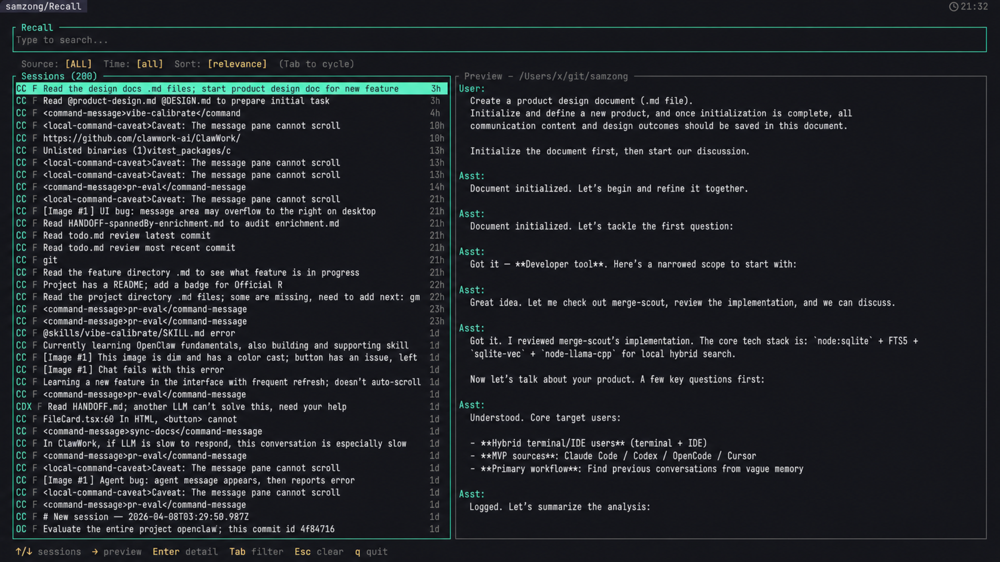

[English](./README.md) | **中文**

# Recall

> 本地优先，搜索你机器上所有 AI 编程会话。

[](https://asciinema.org/a/909453)

在 Claude Code、Codex 以及后续各种 CLI 之间跳转；Recall 将这些分散在本地的会话收进一个可搜索的索引，在可用时跟踪 token 用量，并把你送回原始 CLI。

## 安装

```bash
brew install samzong/tap/recall
```

## 用法

```bash
recall sync          # 增量同步（随时可安全运行）
recall               # 启动 TUI
recall usage         # 用量面板
recall export > recall-export.jsonl # 导出全部会话
recall import recall-export.jsonl --dry-run  # 预览导入
recall session list  # 为 agent/脚本列出会话
recall session share --id <session-id> --format json  # 发布选中的一个会话
recall session delete --id <session-id> --dry-run  # 预览安全删除会话
recall share list --format json  # 列出已发布的分享地址
recall share unpublish <share-id> --yes  # 下线一个公开页面
recall info  # 索引统计与 worker 状态
```

### 终端中的 Agent 图标

`nonlog/Recall` 分支支持与 [herdr-radar](https://github.com/hhdebb/herdr-radar)
一致的 Agent Logo。终端已能正确显示 **Herdr Agent Icons Max** 字体的
`U+E1A0–U+E1BA` 图标时，可启用：

```powershell
$env:RECALL_ICON_STYLE = 'herdr'
recall
```

若需要在以后启动的 Windows Terminal 会话中持续启用，可运行
`[Environment]::SetEnvironmentVariable('RECALL_ICON_STYLE', 'herdr', 'User')`，
再新开终端。Windows Terminal 不支持按 Unicode 码位指定字体，需要使用确实能
显示这些图标的主字体／后备字体配置；herdr-radar 提供的合并字体
`JetBrains Mono Herdr` 是一种选择。**仅安装独立图标字体不保证 WT 能正确选中它。**

此模式需要显式启用，因为 Recall 无法可靠检测终端的字体回退行为。Herdr 未覆盖
的 Agent 继续显示原有 Unicode 图标，默认 Nerd Font 模式与
`RECALL_ICON_STYLE=plain` 都不改变。Recall 不安装或再分发 Herdr 字体。

### 删除会话

`recall session delete` 会从 Recall 删除指定会话；当来源存在安全的原生删除方式时，也会同步删除对应 Agent 的原始会话。

```bash
recall session delete --id <session-id> --dry-run    # 仅预览
recall session delete --id <session-id>              # 安全默认：保留 Recall 回收备份
recall session delete --id <session-id> --permanent  # 不保留 Recall 回收备份
recall session delete --id <session-id> --index-only # 保留原 Agent 数据，只删 Recall 索引
```

Codex 与 OpenCode 使用各自官方删除命令，从而保持它们自己的会话元数据一致。Claude Code、Pi、OMP、Antigravity、Gemini、Grok、Copilot CLI、Cline、DeepSeek Harness 与 Kimi Code 会使用经过验证的独立会话文件或目录。没有稳定原生删除 API 的共享数据库来源需要显式使用 `--index-only`；Recall 不会猜测性地修改这些数据库。

Windows 下默认回收备份位于已安装 `recall.exe` 同目录的 `trash` 目录；Scoop 包会通过 persist 在升级间保留该目录。也可使用 `RECALL_TRASH_DIR` 覆盖位置。其他平台仍回退到 Recall 数据目录。对于带官方原生删除命令的来源，Recall 会先创建安全备份再调用原生命令；对于文件型来源，则把原始会话数据移动到回收目录。导入的会话始终只删除 Recall 索引。

配合 Skill 使用时，**Recall** 是最佳方式。

```bash
recall skill install # 自动检测 agent 并安装 skills
```

## 支持

一个索引覆盖所有 AI 编程 CLI。同步一次，处处搜索，从上次停下的地方继续。

| 适配器          | 发现 | 全量索引 | 增量同步 | 语义搜索 | 导出 | 恢复 | 用量 |
| --------------- | :--: | :------: | :------: | :------: | :--: | :--: | :--: |
| Claude Code     |  ✅  |    ✅    |    ✅    |    ✅    |  ✅  |  ✅  |  ✅  |
| OpenCode        |  ✅  |    ✅    |    ✅    |    ✅    |  ✅  |  ✅  |  ✅  |
| Codex           |  ✅  |    ✅    |    ✅    |    ✅    |  ✅  |  ✅  |  ✅  |
| Pi              |  ✅  |    ✅    |    ✅    |    ✅    |  ✅  |  ✅  |  ✅  |
| OMP             |  ✅  |    ✅    |    ✅    |    ✅    |  ✅  |  ✅  |  ✅  |
| Antigravity     |  ✅  |    ✅    |    ✅    |    ✅    |  ✅  |  ✅  |      |
| Gemini          |  ✅  |    ✅    |    ✅    |    ✅    |  ✅  |  ✅  |  ✅  |
| Kiro            |  ✅  |    ✅    |    ✅    |    ✅    |  ✅  |  —   |      |
| Copilot         |  ✅  |    ✅    |    ✅    |    ✅    |  ✅  |  ✅  |  ✅  |
| Copilot Chat    |  ✅  |    ✅    |    ✅    |    ✅    |  ✅  |  —   |      |
| Cursor          |  ✅  |    ✅    |    ✅    |    ✅    |  ✅  |  —   |  ✅  |
| Cline           |  ✅  |    ✅    |    ✅    |    ✅    |  ✅  |  —   |      |
| Roo             |  ✅  |    ✅    |    ✅    |    ✅    |  ✅  |  —   |      |
| DeepSeek Harness |  ✅  |    ✅    |    ✅    |    ✅    |  ✅  |  —   |  ✅  |
| Grok            |  ✅  |    ✅    |    ✅    |    ✅    |  ✅  |  ✅  |  ✅  |
| Kimi Code       |  ✅  |    ✅    |    ✅    |    ✅    |  ✅  |  ✅  |  ✅  |
| Qwen Code       |  ✅  |    ✅    |    ✅    |    ✅    |  ✅  |  ✅  |  ✅  |
| Kilo Code       |  ✅  |    ✅    |    ✅    |    ✅    |  ✅  |  ✅  |  ✅  |
| Crush           |  ✅  |    ✅    |    ✅    |    ✅    |  ✅  |  ✅  |  ✅  |
| MiMo Code       |  ✅  |    ✅    |    ✅    |    ✅    |  ✅  |  ✅  |  ✅  |
| ZCode           |  ✅  |    ✅    |    ✅    |    ✅    |  ✅  |  ✅  |  ✅  |
| Goose           |  ✅  |    ✅    |    ✅    |    ✅    |  ✅  |  ✅  |  ✅  |
| Droid           |  ✅  |    ✅    |    ✅    |    ✅    |  ✅  |  ✅  |  ✅  |

## 致谢

- 感谢 [tokscale](https://github.com/junhoyeo/tokscale) 提供的用量面板参考与 token 统计行为。
- 感谢 [Ratatui](https://github.com/ratatui/ratatui) 与 [Crossterm](https://github.com/crossterm-rs/crossterm) 提供的终端 UI 基础。
- 感谢 [sqlite-vec](https://github.com/asg017/sqlite-vec) 与 SQLite FTS5，让本地文本与向量搜索保持嵌入式。
- 感谢 [Candle](https://github.com/huggingface/candle)、Hugging Face 与 [intfloat/multilingual-e5-small](https://huggingface.co/intfloat/multilingual-e5-small) 提供的本地语义嵌入。
- 感谢 [kitup](https://github.com/samzong/kitup) 提供的内置 agent skill 安装器。
- 感谢 [LINUX DO](https://linux.do/) 开源分享社区。

## 许可证

本项目采用 [MIT](LICENSE) 许可证。
